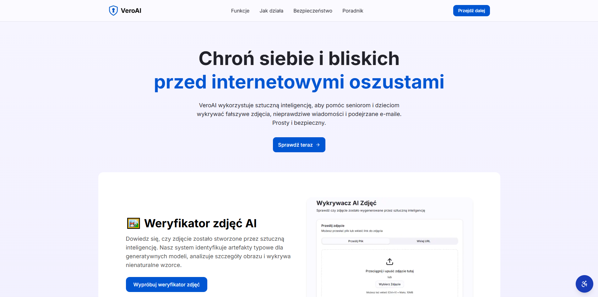

# VeroAI

  

VeroAI is a powerful and intuitive platform that uses **Gemini**, to help seniors and children identify fake images, misleading news, and phishing emails. With its user-friendly interface and advanced AI technology, VeroAI aims to protect users from online fraud and misinformation.

---

## Features

### 1. **AI Image Verifier** 🖼️
- Detects images generated by AI, analyzes image details, and identifies unnatural patterns and artifacts typical of generative models.

### 2. **News Verifier** 📰
- Quickly verifies if news articles and content are from reliable sources, detecting signs of misinformation or disinformation.

### 3. **Email Verifier** 📧
- Analyzes email addresses to check if they are valid, active, and potentially suspicious, helping users avoid phishing attempts.

### 4. **Password Generator** 🔐
- Generates secure and unique passwords tailored to the user's needs, with customizable length and complexity.

---

## How It Works

VeroAI makes it simple to check the authenticity of images, news, and emails using **Gemini**, an advanced LLM, for accurate analysis. The process is straightforward:

1. **Choose the verification type** – Select whether you want to verify an image, news article, or email.
2. **Input the data** – Paste a link, upload a file, or enter the text.
3. **Wait for AI analysis** – VeroAI processes the input using Gemini's advanced AI algorithms.
4. **Receive the result** – Get a detailed report with an explanation of the findings.

---

## Installation

To get started with the project, follow these steps:

1. **Clone the repository**:
    ```bash
    git clone https://github.com/your-username/veroai.git
    ```

2. **Install dependencies**:
    Navigate to the project directory and install the required dependencies:
    ```bash
    cd veroai
    npm install
    ```

3. **Set up Supabase**:
    Create a **Supabase** account and set up a project at [https://supabase.com](https://supabase.com).
    - Add your Supabase credentials (URL and anon key) to your `.env.local` file:
      ```bash
      NEXT_PUBLIC_SUPABASE_URL=your-supabase-url
      NEXT_PUBLIC_SUPABASE_ANON_KEY=your-supabase-anon-key
      ```

4. **Set up Gemini API Key**:
    - Sign in with your **Google** account and get your API key from [Google AI Studio](https://aistudio.google.com/welcome?utm_source=google&utm_medium=cpc&utm_campaign=FY25-global-DR-gsem-BKWS-1710442&utm_content=text-ad-none-any-DEV_c-CRE_726176651981-ADGP_Hybrid%20%7C%20BKWS%20-%20EXA%20%7C%20Txt-Gemini%20(Top%20EEA)-Gemini%20API%20Key-KWID_2264197237826-kwd-2264197237826&utm_term=KW_get%20gemini%20api%20key-ST_get%20gemini%20api%20key&gclsrc=aw.ds&gad_source=1&gad_campaignid=21341690381&gbraid=0AAAAACn9t66iUWb1os8njB6ibc_Nf4qZy&gclid=EAIaIQobChMIg7mE0u_EkQMV6bCDBx1LNzFLEAAYASAAEgIuH_D_BwE).

      ```bash
      supabase secrets set GEMINI_API_KEY=your-gemini-key
      ```

5. **Run the development server**:
    Start the development server to run the application locally:
    ```bash
    npm run dev
    ```

6. Open your browser and go to `http://localhost:3000` to view the application.


---

## Technologies Used

- **Next.js**: React-based framework for server-side rendering (SSR) and static site generation (SSG).
- **React**: JavaScript library for building user interfaces.
- **Tailwind CSS**: Utility-first CSS framework for rapid UI development.
- **TypeScript**: Superset of JavaScript that provides static typing to improve development and code quality.
- **Supabase**: Open-source Firebase alternative for backend services, including authentication, database, and real-time data management.
- **Tanstack Query**: Custom context provider to manage API queries and states.
- **Gemini**: Advanced LLM (Large Language Model) for image, news, and email verification tasks.

---

## Demo

You can try the app live at [https://veroai.vercel.app](https://veroai.vercel.app).

